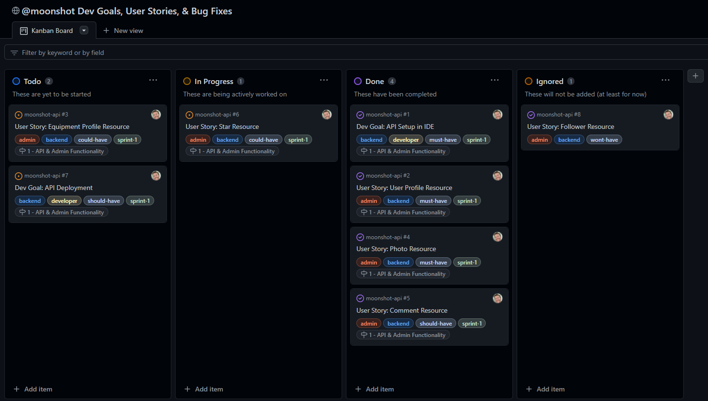
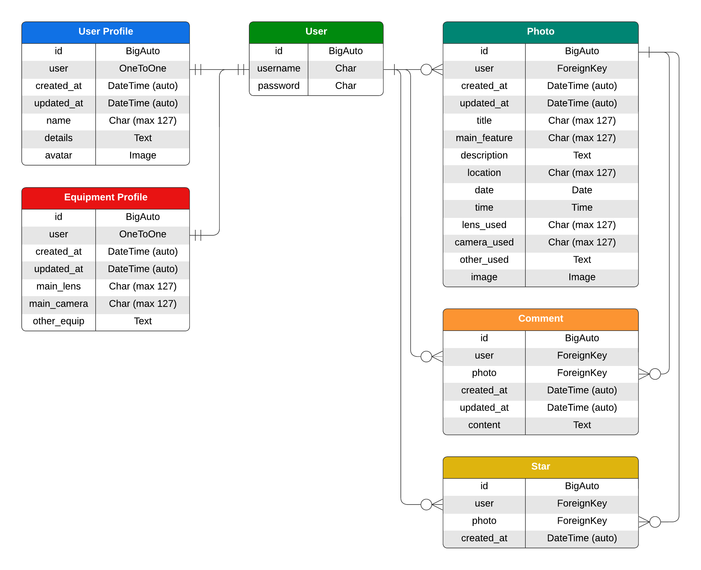
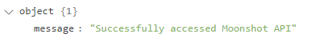
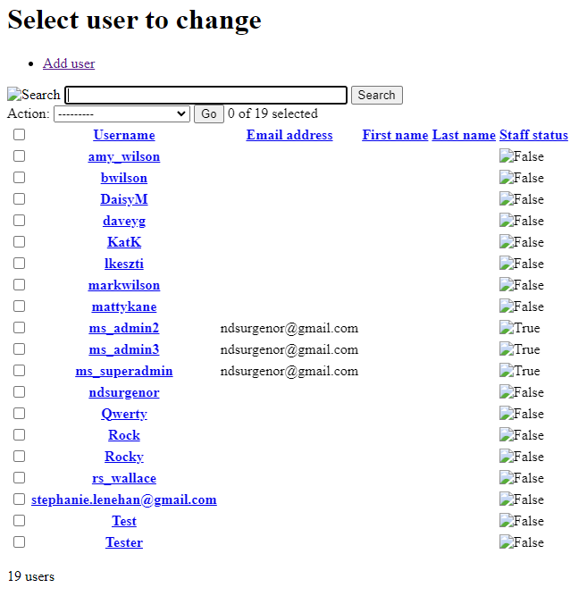
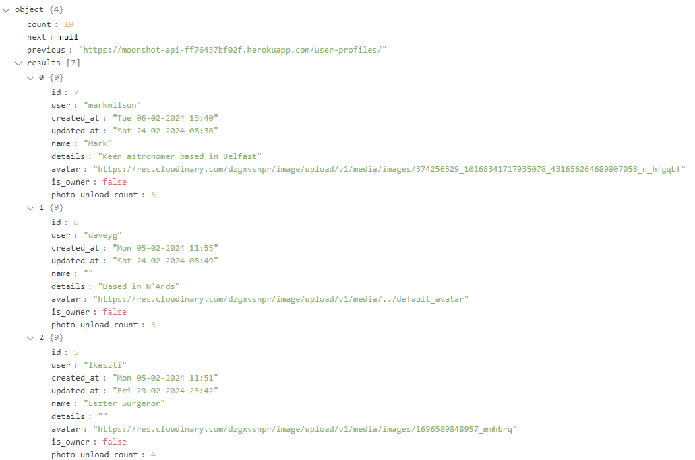
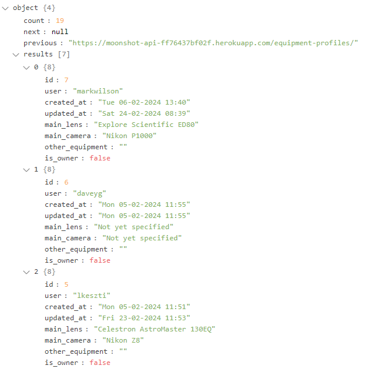
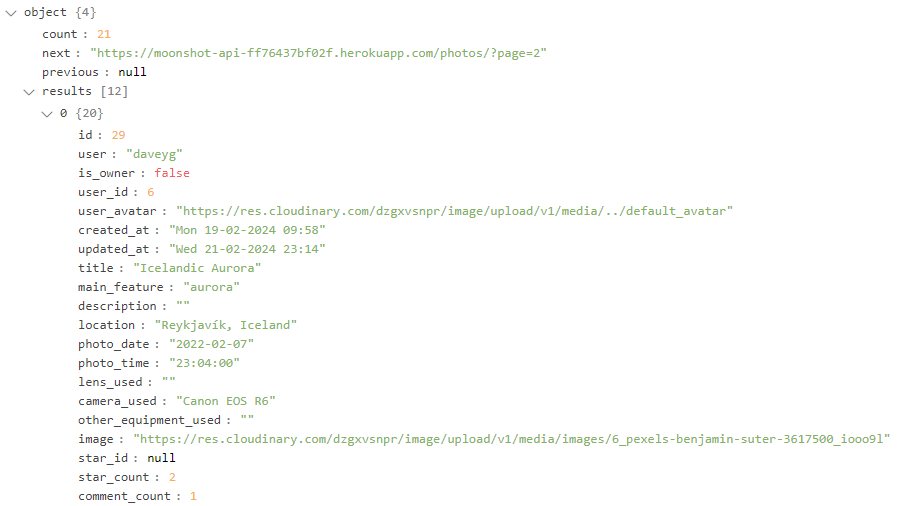
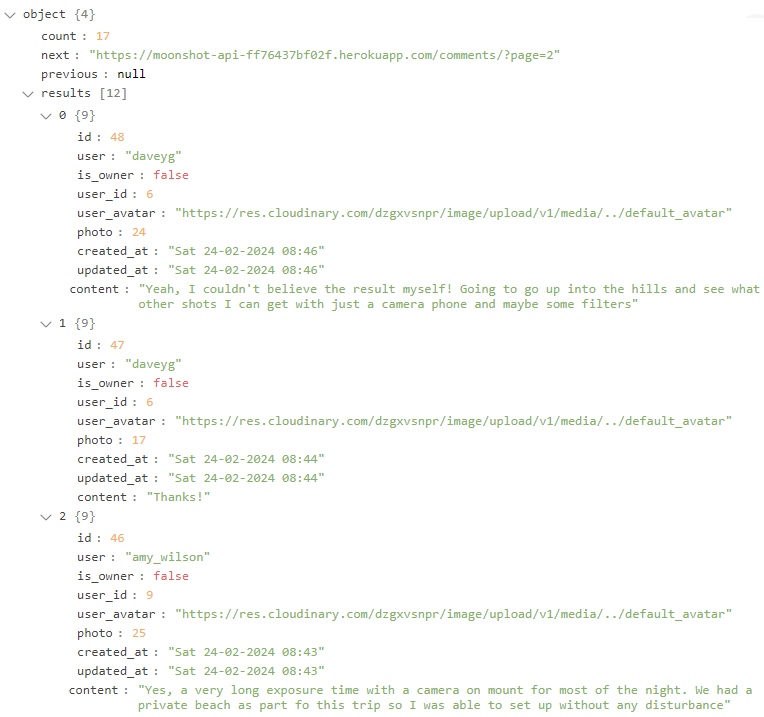
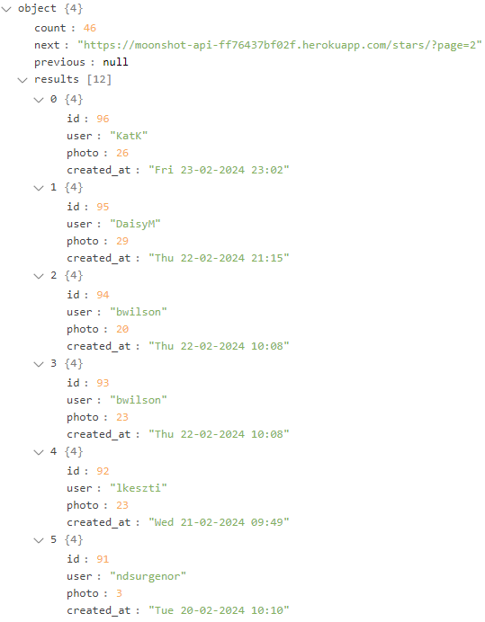

# moonshot-api
_Please note that this README file outlines the backend development of this application; if you require info on frontend development please navigate to [the README for moonshot](https://github.com/ndsurgenor/moonshot/blob/main/README.md)_

Moonshot (stylised completely in lowercase) is a web application built for the sharing and discussion around amateur astrophtography. This site has been designed to allow imagined users and visitors the ability to view photos uploaded by registered users of the site; registered users will also be able to create a personal profile and 'star' (that is, like) and comment on other users' posts.

[LIVE LINK to API](https://moonshot-api-ff76437bf02f.herokuapp.com/)<br>
[LIVE LINK to Application](https://moonshot-13d14b7a6fbd.herokuapp.com/)<br>
_Note: to open links in a new tab, hold CTRL + Click_

## Table Of Contents
- [Introduction](#moonshot)
- [Strategy](#strategy)
  - [Milestone 1 - API & Admin Functionality](#milestone-1---api--admin-functionality)
  - [Milestone 2 - Frontend Navigation](#milestone-2---frontend-navigation)
  - [Milestone 3 - User Access](#milestone-3---user-access)
  - [Milestone 4 - Photo Uploads](#milestone-4---photo-uploads)
  - [Milestone 5 - Home & Profile Pages](#milestone-5---home--profile-pages)
  - [Milestone 6 - Community Interaction](#milestone-6---community-interaction)
- [Scope](#scope)
- [Structure](#structure)
- [Skeleton](#skeleton)
  - [Wireframe Models](#wireframe-models)
- [Surface](#surface)
  - [Design & Typography](#design--typography)
  - [Features Implemented](#features-implemented)
  - [Features To Be Implemented](#features-to-be-implemented)
  - [Technology & Resources](#technology--resources)
- [Testing](#testing)
- [Deployment](#deployment)
  - [Heroku Deployment](#heroku-deployment)
  - [Forking The Repository](#forking-the-respository)
  - [Cloning The Repository](#cloning-the-respository)
- [Credits & Acknowledgements](#credits--acknowledgements)

## UX Design

The site is aimed at helping users to easily upload their personal photos of the nightsky alongside relevant info such as what the photo shows, where/when it was taken, and what equipment was used. It also aims to give users the ability to view, star, and comment on the photos uploaded by other users of the site. This backend site models these details so they can be controlled by a superuser and also be utilised by the user via the frontend components. 

## Strategy

### Milestones & User Stories
This project was developed with 6 milestones (epics) in mind. From each of these milestones a number of dev goals and user stories were created, each one given a prioritisation using the MoSCoW method. The detail of these milestones, goals, and stories implemented in the final project is outlined below; further detail regarding sprints, MoSCoW designation and acceptance criteria (covered under Structure) are included on the [GitHub Projects Kanban Board](https://github.com/users/ndsurgenor/projects/9) created for the project.



#### Milestone 1 - API & Admin Functionality
- 1.1 - Dev Goal: set up Django REST and its supporting libraries via the IDE in order for API development to begin
- 1.2 - User Story: as a Site Admin I want to be able to create and edit User Profiles so I can control user permissions on the frontend
- 1.3 - User Story: as a Site Admin I want to be able to review and edit Equipment Profiles for users so I can details on the frontend
- 1.4 - User Story: as a Site Admin I want to be able to review and edit Photo uploads so I can allow and control images on the frontend
- 1.5 - User Story: as a Site Admin I want to be able to review and edit Comments for so I can allow and control comments on the frontend
- 1.6 - User Story: as a Site Admin I want to be able to review and edit Star ratings (photo ratings) by users so I can allow and control star ratings on the frontend
- 1.7 - User Story: as a Site Admin I want to have access to search and filtering tools on the backend so I can find and edit particular data more easily
- 1.8 - Dev Goal: create an early API deployment to Heroku to ensure all is working from the very start and allow continuous testing throughout production

#### Milestone 2 - Frontend Navigation
- 2.1 - Dev Goal: set up ReactJS and its supporting libraries via the IDE and create an early  deployment to Heroku in for frontend development to begin and to ensure all is working from the very start
- 2.2 - User Story: as a Site Visitor/User I want access to navigation links at the top of every page so I can easily move between different areas of the site
- 2.3 - User Story: as a Site Visitor I want to easily access a sign up page so I can become a registered user and upload my own content/directly particpate with other users of the site
- 2.4 - User Story: as a Site User I want to easily access a sign in page so I can use the full functionality of the site

#### Milestone 3 - User Access
- 3.1 - User Story: as a Site User I want view additional navigational links so that I can access those areas of the site only available to registered users
- 3.2 - User Story: as a Site User I want to remain logged in to the site until I choose otherwise so that my experience is not interuppted by having to continously re-enter my username and password
- 3.3 - User Story: as a Site Visitor/User I want have a clear indication as to whether or not I am logged in/logged out so I can easily discern if I need to sign up/sign in before accessing certain pages
- 3.4 - User Story: as a Site User I want to be able to sign out from my account so that I know my account cannot be accessed by unauthorised persons

#### Milestone 4 - Photo Uploads
- 4.1 - User Story: as a Site User I want to be able to upload my own astrological photos to the site so that they are shared on the home page and commented on/upvoted by others
- 4.2 - User Story: as a Site User I want to include specific details such as keywords, date, time, location etc. with my uploaded photos so that those details can be displayed alongside the photo for the benefit of other users
- 4.3 - User Story: as a Site User I want to be able to update the details of any photo I have added so that I can correct mistakes or add new information if required
- 4.4 - User Story: as a Site User I want to be able to delete any photo I have added so that I can remove my photos from the site if I so desire
- 4.5 - Dev Goal: write defensive code to prevent anyone from accessing the ability to update/delete posts which were not specifically uploaded by them

#### Milestone 5 - Home & Profile Pages
- 5.1 - User Story: as a Site Visitor/User I want to view all user photos from the home page so I can see the latest content when first accessing the site
- 5.2 - User Story: as a Site User I want to be able to continously scroll through photos so that I don't have to navigate between and reload multiple pages
- 5.3 - User Story: as a Site User I want to be able to search photos with keywords (title, feature, user, etc.) so I can view content specifically related to those keywords
- 5.4 - User Story: as a Site User I want to be able to select an individual photo from the feed so I can view details, comments, and upvotes directly associated with that photo
- 5.5 - User Story: as a Site User I want to be able to access a personalised profile page so that I can add an avatar, personal bio and equipment details

#### Milestone 6 - Community Interaction
- 6.1 User Story: as a Site User I want to be able to upvote other users photos so that I can show my appreciation for their photography
- 6.2 User Story: as a Site User I want to be able to comment on other users photos so that I can ask questions and/or start a discussion about the photo
- 6.3 - User Story: as a Site User I want to view a feed of those photos I've upvoted so I have easy access to those posts I've shown a particular interest in
- 6.4 - User Story: as a Site User I want to view a feed of those photos I've commented on so I have easy access to posts where I am involved in a discussion thread

## Scope

Using these milestones, goals, and stories to guide my thinking, the following was planned as the Scope of the project:

- Responsive Design:
  - Resizing on all devices from 320px upwards (consideration for 280px+ also given)
  - Toggle menu for navbar links at smaller sizes
- Home page displaying the latest uploads and links appropriate to logged-out/in status (for * see below):
  - Home (available to all users)
  - Sign Up  (logged-out)
  - Sign In  (logged-out)
  - Upload  (logged-in)
  - Profile* (logged-in)
  - Gear* (logged-in)
  - Account* (logged-in)
  - Sign Out* (logged-in)
- Features appearing on the site as appropriate:
  - Gallery with 'masonary' layout for photo feeds (Home, Profile)
  - Infite scroll on photo feeds (Home, Profile)
  - Ability to search for photos using filters/search bar (Home signed-in, Profile)
  - Ability to star (like)/comment on other users' photos
  - User avatar appearing in navbar
  - Pages marked * above in dropdown menu when viewed on medium/large screens
- Stylised 404 papge

## Structure

With Strategy and Scope now in place, focus shifted to setting acceptance criteria for each of the above, thereby informing exactly what features to include as part of the project. These acceptance criteria were added to each Dev Goal and User Story on the aforementioned Kanban board to act as an insurance that task would be completed to the fullest extent needed.

### Features/Components
Hovering over a reference (Ref) number below will display a description of that Dev Goal/User Story while clicking the link will return you to the relevant Milestone section of this document.

**Milestone**|**Ref**|**Type**|**Acceptance Criteria/Features**
:-----:|:-----:|:-----:|-----
API|[1.1](#milestone-1---api--admin-functionality "Set up Django REST and its supporting libraries via the IDE in order for API development to begin")|Dev Goal|<ul><li>Set up GitPod workspace</li><li>Install LTS version of Django</li><li>Start project 'moonshot_api'</li><li>Install Cloudinary and Pillow modules</li><li>Set up env.py</li></ul>
API|[1.2](#milestone-1---api--admin-functionality "As a Site Admin I want to be able to create and edit User Profiles so I can control user permissions on the frontend")|User Story|<ul><li>Create UserProfile model</li><li>Create UserProfile serializer</li><li>Create UserProfile GET and PUT views</li><li>Implement permissions for editing</li></ul>
API|[1.3](#milestone-1---api--admin-functionality "As a Site Admin I want to be able to review and edit Equipment Profiles for users so I can allow and control details on the frontend")|User Story|<ul><li>Create EquipmentProfile model</li><li>Create EquipmentProfile serializer</li><li>Create EquipmentProfile GET and PUT views</li><li>Update fields in Photo model and serializer</li></ul>
API|[1.4](#milestone-1---api--admin-functionality "As a Site Admin I want to be able to review and edit Photo uploads so I can allow and control images on the frontend")|User Story|<ul><li>Create Photo model</li><li>Create Photo serializer</li><li>Add validation to prevent large file sizes/dimensions</li><li>Create Photo GET, POST, PUT and DELETE views</li></ul>
API|[1.5](#milestone-1---api--admin-functionality "As a Site Admin I want to be able to review and edit Comments for so I can allow and control comments on the frontend")|User Story|<ul><li>Create Comment model</li><li>Create Comment serializer</li><li>Create Comment GET, POST, PUT and DELETE functionality</li><li>Implement permissions for editing</li></ul>
API|[1.6](#milestone-1---api--admin-functionality "As a Site Admin I want to be able to review and edit Star ratings (photo ratings) by users so I can allow and control star ratings on the frontend")|User Story|<ul><li>Create Star model</li><li>Create Star serializer</li><li>Create Star GET, POST, PUT and DELETE views</li><li>Implement permissions for editing</li></ul>
API|[1.7](#milestone-1---api--admin-functionality "As a Site Admin I want to have access to search and filtering tools on the backend so I can find and edit particular data more easily")|User Story|<ul><li>Install django-filter module</li><li>Add search and filter features to User Profiles</li><li>Add search and filter features to Photos</li><li>Add search and filter features to Comments</li></ul>
API|[1.8](#milestone-1---api--admin-functionality "Create an early API deployment to Heroku to ensure all is working from the very start and allow continuous testing throughout production")|Dev Goal|<ul><li>Install django-rest-auth, all-auth and simpleJWT libraries</li><li>Update settings.py and urls.py and migrate changes</li><li>Migrate to PostgreSQL</li><li>Deply to Heroku</li></ul>
Navigation|[2.1](#milestone-2---frontend-navigation "set up ReactJS and its supporting libraries via the IDE and create an early deployment to Heroku in for frontend development to begin and to ensure all is working from the very start")|Dev Goal|<ul><li>Set up GitPod workspace and install npm</li><li>Install Bootstrap for React</li><li>Test App.js with h1 text and Button component</li><li>Deploy to Heroku</li></ul>
Navigation|[2.2](#milestone-2---frontend-navigation "As a Site Visitor/User I want access to navigation links at the top of every page so I can easily move between different areas of the site")|User Story|<ul><li>Create NavBar.js component</li><li>Create Home, Sign Up and Sign In links</li><li>Add Bootstrap styling and icons</li></ul>
Navigation|[2.3](#milestone-2---frontend-navigation "As a Site Visitor I want to easily access a sign up page so I can become a registered user and upload my own content/directly particpate with other users of the site")|User Story|<ul><li>Connect frontend to moonshot-api using axios</li><li>Add basic structure including Form component</li><li>Add code to handle form events and errors</li><li>Add custom styles using CSS</li></ul>
Navigation|[2.4](#milestone-2---frontend-navigation "As a Site User I want to easily access a sign in page so I can use the full functionality of the site")|User Story|<ul><li>Add basic structure including Form component</li><li>Add code to handle form events and errors</li><li>Connect custom styles coded using CSS</li></ul>
Access |[3.1](#milestone-3---user-access "As a Site User I want view additional navigational links so that I can access those areas of the site only available to registered users")|User Story|<ul><li>Add Upload, Profile, and Sign Out links</li><li>Add code to set currentUser and related queries</li><li>Add code to only show links when signed in</li></ul>
Access |[3.2](#milestone-3---user-access "As a Site User I want to remain logged in to the site until I choose otherwise so that my experience is not interrupted by having to continously re-enter my username and password")|User Story|<ul><li>Add axios request interceptor</li><li>Add axios response interceptor</li></ul>
Access |[3.3](#milestone-3---user-access "As a Site Visitor/User I want have a clear indication as to whether or not I am logged in/logged out so I can easily discern if I need to sign up/sign in before accessing certain pages")|User Story|<ul><li>Create Avatar component and styling</li><li>Display username and avatar in navbar</li></ul>
Access |[3.4](#milestone-3---user-access "As a Site User I want to be able to sign out from my account so that I know my account cannot be accessed by unauthorised persons")|Dev Goal|<ul><li>Add code to Sign Out link</li></ul>
Photos|[4.1](#milestone-4---photo-uploads "As a Site User I want to be able to upload my own astrological photos to the site so that they are shared on the home page and can be commented on/upvoted by other users")|User Story|<ul><li>Create form with relevant fields</li><li>Add code showing photo preview</li><li>Connect form to API</li><li>Add alerts for errors</li><li>Style form to display correctly</li></ul>
Photos|[4.2](#milestone-4---photo-uploads "As a Site User I want to include specific details such as keywords, date, time, location etc. with my uploaded photos so that those details can be displayed alongside the photo for the benefit of other users")|User Story|<ul><li>Create Photo page and connect to API</li><li>Add code for title, user and image display</li><li>Add code to display photo information</li><li>Add code to display number of stars/comments</li><li>Style the Photo Page and Photo Card</li></ul>
Photos|[4.3](#milestone-4---photo-uploads "As a Site User I want to be able to update the details of any photo I have added so that I can correct mistakes or add new information if required")|User Story|<ul><li>Create form fields for editing post</li><li>Retrieve details from API to pre-populate fields</li><li>Add code to prevent unauthorised users from accessing form</li></ul>
Photos|[4.4](#milestone-4---photo-uploads "As a Site User I want to be able to delete any photo I have added so that I can remove my photos from the site if I so desire")|User Story|<ul><li>Create delete button only visible to photo owner</li><li>Create confirmation modal to ensure deletion is wanted</li><li>Add code to remove photo from the database</li><li>Style created components</li></ul>
Photos|[4.5](#milestone-4---photo-uploads "Write defensive code to prevent anyone from accessing the ability to update/delete posts which were not specifically uploaded by them")|Dev Goal|<ul><li>Create useRedirect hook</li><li>Add hook to relevant pages to redirect users</li></ul>
Pages|[5.1](#milestone-5---home--profile-pages "As a Site Visitor/User I want to view all user posts from the home page so I can see the latest content when first accessing the site")|User Story|<ul><li>Add photo feed to display user photos</li><li>Add infinite scroll to photos</li><li>Style photo feed using react-responsive-masonry</li></ul>
Pages|[5.2](#milestone-5---home--profile-pages "As a Site User I want to be able to continously scroll through posts so that I don't have to navigate between and reload multiple pages")|User Story|<ul><li>Install react-infinite-scroll-component</li><li>Add Infinite Scroll component to PhotoFeed</li><li>Create reusable getMoreData utility and add to infinite scroll</li></ul>
Pages|[5.3](#milestone-5---home--profile-pages "As a Site User I want to be able to search photos for keywords (title, feature, user etc.) so I can view content specifically related to those keywords")|User Story|<ul><li>Add search bar to photo feed</li><li>Add code to connect input field to API</li><li>Style search bar</li></ul>
Pages|[5.4](#milestone-5---home--profile-pages "As a Site User I want to be able to select an individual photo from the feed so I can view details, comments, and upvotes directly associated with that photo")|User Story|<ul><li>Add link to photos in Home Page feed</li><li>Display selected photo on its own page</li><li>Display full details not shown on the Home Page feed</li><li>Display Edit & Delete buttons for owner of the photo</li></ul>
Pages|[5.5](#milestone-5---home--profile-pages "As a Site User I want to be able to access a personalised profile page so that I can add an avatar, personal bio and equipment details")|User Story|<ul><li>Dedicated profile page for user</li><li>Display of user's photos</li><li>Details regarding user</li><li>Gear page to edit and update details</li><li>Account page to edit and update details</li></ul>
Interaction|[6.1](#milestone-6---community-interaction "As a Site User I want to be able to upvote other users photos so that I can show my appreciation for their photography")|User Story|<ul><li>Prevent user from adding a star to their own photo</li><li>Allow user to add a star to other users' photos</li><li>Allow user to remove star from other users' photos</li><li>Increment/decrement star count accordingly</li></ul>
Interaction|[6.2](#milestone-6---community-interaction "As a Site User I want to be able to comment on other users photos so that I can ask questions and/or start a discussion about the photo")|User Story|<ul><li>Add a form to let users create comments</li><li>Show all comments made on Photo Page</li><li>Allow users to edit/delete comments</li><li>Add infinite scroll to comments</li><li>Style comment forms and displays</li></ul>
Interaction|[6.3](#milestone-6---community-interaction "As a Site User I want to view a feed of those photos I've upvoted so I have easy access to those photos I've shown a particular interest in")|User Story|<ul><li>Add filter buttons to signed in home page</li><li>Add route to connect to API and filter correct content</li><li>Style filter buttons</li></ul>
Interaction|[6.4](#milestone-6---community-interaction "As a Site User I want to view a feed of those photos I've commented on so I have easy access to photos where I am involved in a discussion thread")|User Story|<ul><li>Add filter buttons to signed in home page</li><li>Add route to connect to API and filter correct content</li><li>Style filter buttons</li></ul>

## Skeleton

### Database Model
Now that specific features had been decided upon, a database model was designed to give guidance as to how these features would relate to one another at the backend.

The structure was designed on the basis of exposing endpoints in the [django-rest-allauth](https://django-rest-auth.readthedocs.io/en/latest/installation.html) to handle authentication with the User model, while the other models would be linked ot this and completely coded by myself.

The diagram below shows the relationship of various tables within the project. The models on the left, User Profile and Equipment Profile as set up to automatically create an instance whenever a user signs up/is created via the User model. The models on the right create instances whenever the admin/user specifically creates them, the Photo model being capable of have numerous instance associated with one User and the Stars/Comments likewise in relation to the Photo model.



## Surface

With the database design now in place, actual models for the site could now be coded using the Django REST framework and the `dj-rest-auth` packages using the criteria listed above to inform the process.

### Features
Each of the following implementations was added in response to the user stories and acceptance criteria above, details of which are provided below each feature heading for easy reference.

#### Welcome Message
The initial page of the API displays a brief welcome message confirming connected with the site and its name. This page is accessed via https://moonshot-api-ff76437bf02f.herokuapp.com



#### User model
> &bull; 1.2 - User Story: as a Site Admin I want to be able to create and edit User Profiles so I can control user permissions on the frontend  
&bull; 2.3 - User Story: as a Site Visitor I want to easily access a sign up page so I can become a registered user and upload my own content/directly particpate with other users of the site  
&bull; 2.4 - User Story: as a Site User I want to easily access a sign in page so I can use the full functionality of the site  
&bull; 3.4 - User Story: as a Site User I want to be able to sign out from my account so that I know my account cannot be accessed by unauthorised persons



- The User model is accessed by appending ['/admin/auth/user/'](https://moonshot-api-ff76437bf02f.herokuapp.com/admin/auth/user/) to the main API url and requires admin privileges to access
- User model functionality is handled by [dj-rest-auth](https://dj-rest-auth.readthedocs.io/en/latest/) and so models, serializers, views etc. apepar directly as folders within this application
- When a User model instance is created a directly associated User Profile and Equipment Profile instance is also created with identical 'id' values

#### User Profile model
> &bull; 1.2 - User Story: as a Site Admin I want to be able to create and edit User Profiles so I can control user permissions on the frontend  
&bull; 1.7 - User Story: as a Site Admin I want to have access to search and filtering tools on the backend so I can find and edit particular data more easily  
&bull; 5.5 - User Story: as a Site User I want to be able to access a personalised profile page so that I can add an avatar, personal bio, and equipment details



- A User Profile model instance is created automatically whenever a user signs up/is created using the User model
- The User Profile model is accessed by appending ['/user-profiles/'](https://moonshot-api-ff76437bf02f.herokuapp.com/user-profiles/) to the main API url; an individual record of this model is accessed by also appending the relevant id
- User Profile admin access is achieved by appending ['/admin/user_profiles/'](https://moonshot-api-ff76437bf02f.herokuapp.com/admin/user_profiles/) to the main API url, but requires admin privileges to access  
- The model uses GET and PUT views to list and update user profiles respectively
- In addition to those shown in the diagram above, 'is_owner' and 'photo_upload_count' fields have been added to the model through use of a serializer
- A default avatar is added to every User profile by means of connection to the Cloudinary API
- Ordering fields have been added to the model to allow ordering by 'created_at' and 'photo_upload_count'
- Search fields have been added to the model to allow searching of associated username and name attributes

#### Equipment Profile model
> &bull; 1.3 - User Story: as a Site Admin I want to be able to review and edit Equipment Profiles for users so I can details on the frontend  
&bull; 1.7 - User Story: as a Site Admin I want to have access to search and filtering tools on the backend so I can find and edit particular data more easily  
&bull; 5.5 - User Story: as a Site User I want to be able to access a personalised profile page so that I can add an avatar, personal bio, and equipment details



- An Equipment Profile model instance is created automatically whenever a user signs up/is created using the User model
- The Equipment Profile model is accessed by appending ['/equipment-profiles/'](https://moonshot-api-ff76437bf02f.herokuapp.com/equipment-profiles/) to the main API url; an individual record of this model is accessed by also appending the relevant id
- Equipment Profile admin access is achieved by appending ['/admin/equipment_profiles/'](https://moonshot-api-ff76437bf02f.herokuapp.com/admin/equipment_profiles/) to the main API url, but requires admin privileges to access
- The model uses GET and PUT views to list and update equipment profiles respectively
- In addition to those fields shown in the diagram above, an 'is_owner' field has been added to the model through use of a serializer
- Filters have been added to allow filtering by user
- Ordering fields have been added to the model to allow ordering by 'created_at'
- Search fields have been added to the model to allow searching of associated username, main lens, main camera, and other equipment attributes

#### Photo model
> &bull; 1.4 - User Story: as a Site Admin I want to be able to review and edit Photo uploads so I can allow and control images on the frontend  
&bull; 1.7 - User Story: as a Site Admin I want to have access to search and filtering tools on the backend so I can find and edit particular data more easily  
&bull; 4.1 - User Story: as a Site User I want to be able to upload my own astrological photos to the site so that they are shared on the home page and commented on/upvoted by others  
&bull; 4.2 - User Story: as a Site User I want to include specific details such as keywords, date, time, location etc. with my uploaded photos so that those details can be displayed alongside the photo for the benefit of other users  
&bull; 4.3 - User Story: as a Site User I want to be able to update the details of any photo I have added so that I can correct mistakes or add new information if required  
&bull; 4.4 - User Story: as a Site User I want to be able to delete any photo I have added so that I can remove my photos from the site if I so desire  
&bull; 4.5 - Dev Goal: write defensive code to prevent anyone from accessing the ability to update/delete posts which were not specifically uploaded by them  
&bull; 5.3 - User Story: as a Site User I want to be able to search photos with keywords (title, feature, user, etc.) so I can view content specifically related to those keywords  
&bull; 5.4 - User Story: as a Site User I want to be able to select an individual photo from the feed so I can view details, comments, and upvotes directly associated with that photo  



- The Photo model is accessed by appending ['/photos/'](https://moonshot-api-ff76437bf02f.herokuapp.com/photos/) to the main API url; an individual record of this model is accessed by also appending the relevant id
- Photo admin access is achieved by appending ['/admin/photos/'](https://moonshot-api-ff76437bf02f.herokuapp.com/admin/photos/) to the main API url, but requires admin privileges to access 
- The model uses GET, POST, PUT and DELETE views to list, create, update and delete photos respectively
- Variables have been added to the 'main_feature' field to limit permitted values
- In addition to those shown in the diagram above, 'user', 'user_avatar', 'is_owner', 'star_id', 'star_count' and 'comment_count' fields have been added to the model through use of a serializer
- Image validation has also been added via the serializer to ensure that photos are less than 4MB in size and les than 7096px in width/height
- Filters have been added to the model to allow filtering by users, main features, associated profiles, and stars/comments associated with a particular photo instance 
- Ordering fields have been added to the model to allow ordering by 'created_at', 'star_count' and 'comment_count'
- Search fields have been added to the model to allow searching of users, titles, main features, desciptions, and locations

#### Comment model
> &bull; 1.5 - User Story: as a Site Admin I want to be able to review and edit Comments for so I can allow and control comments on the frontend  
&bull; 1.7 - User Story: as a Site Admin I want to have access to search and filtering tools on the backend so I can find and edit particular data more easily  
&bull; 6.2 User Story: as a Site User I want to be able to comment on other users photos so that I can ask questions and/or start a discussion about the photo  
&bull; 6.4 - User Story: as a Site User I want to view a feed of those photos I've commented on so I have easy access to posts where I am involved in a discussion thread



- The Comment model is accessed by appending ['/comments/'](https://moonshot-api-ff76437bf02f.herokuapp.com/comments/) to the main API url; an individual record of this model is accessed by also appending the relevant id
- Comment admin access is achieved by appending ['/admin/comments/'](https://moonshot-api-ff76437bf02f.herokuapp.com/admin/comments/) to the main API url, but requires admin privileges to access 
- The model uses GET, POST, PUT and DELETE views to list, create, update and delete comments respectively
- In addition to those shown in the diagram above, 'user_id', 'user_avatar' and 'is_owner' fields have been added to the model through use of a serializer
- Filters have been added to the model to allow filtering by assocaited users and photos 
- Ordering fields have been added to the model to allow ordering by 'created_at'
- Search fields have been added to the model to allow searching of associated usernames and content

#### Star model
> &bull; 1.6 - User Story: as a Site Admin I want to be able to review and edit Star ratings (photo ratings) by users so I can allow and control star ratings on the frontend  
&bull; 1.7 - User Story: as a Site Admin I want to have access to search and filtering tools on the backend so I can find and edit particular data more easily  
&bull; 6.1 User Story: as a Site User I want to be able to upvote other users photos so that I can show my appreciation for their photography  
&bull; 6.3 - User Story: as a Site User I want to view a feed of those photos I've upvoted so I have easy access to those posts I've shown a particular interest in



- The Star model is accessed by appending ['/stars/'](https://moonshot-api-ff76437bf02f.herokuapp.com/stars/) to the main API url; an individual record of this model is accessed by also appending the relevant id
- Star admin access is achieved by appending ['/admin/stars/'](https://moonshot-api-ff76437bf02f.herokuapp.com/admin/stars/) to the main API url, but requires admin privileges to access 
- The model uses GET, POST, PUT and DELETE views to list, create, update and delete stars respectively

### Features to be implemented

The following features have been identified as long-term goals which bring value to the UX; however, they have not been implemented at this stage as they would require a significant time investment, thereby delaying vital other features of the site, or a level of programming knowledge which I haven't yet developed. 

- Following/unfollowing other users: requires a new model at the backend and extensive work on the frontend which was not within the time capabilities of the initial project

### Technology & Resources

#### Technologies Used
In order to code and design these features and components the following technologies were utilised:

- Dependencies
  - asgiref==3.3.4
  - cloudinary==1.25.0
  - dj-rest-auth==2.1.9
  - dj-database-url==0.5.0
  - Django==3.2.4
  - django-allauth==0.44.0
  - django-cloudinary-storage==0.3.0
  - django-cors-headers==4.3.0
  - django-filter==2.4.0
  - djangorestframework==3.12.4
  - djangorestframework-simplejwt==4.7.2
  - gunicorn==20.1.0
  - oauthlib==3.1.1
  - Pillow==9.2.0
  - psycopg2-binary==2.9.9
  - PyJWT==2.1.0
  - python3-openid==3.2.0
  - pytz==2021.1
  - requests==2.31
  - requests-oauthlib==1.3.0
  - sqlparse==0.4.1
  - urllib3==1.26.15
- [Django REST Framework](https://www.django-rest-framework.org/)
  - Used as main toolkit for building theAPI
- [Python](https://www.python.org/)
  - Used as the main coding language in the backend development of this project
- [Django Allauth](https://docs.allauth.org/en/latest/)
  - Used for sign up/in/out authentication
- [ElephantSQL](https://elephantsql.com)
  - Used as the database hosting service
- [Cloudinary](https://cloudinary.com/) & [Pillow](https://pillow.readthedocs.io/en/stable/handbook/overview.html)
  - Used to host and process image files contained within the User Profile and Photo models
- [Heroku](https://heroku.com)
  - Used as the cloud-based deployment platform for this project

#### Packages Used (front & backend)
- [Gitpod](https://gitpod.io) used to code the site and transfer files between the editor and the repository
- [GitHub](https://github.com) used to store the files for this project
- [Cacoo](https://cacoo.com) used to develop the wireframe models for the site design
- [Lucid Chart](https://lucid.app/) used to create the database diagram
- [Google Fonts](https://fonts.google.com/) used to style the text throughout the site
- [Coolors](https://coolors.co/) used to help create the colour scheme
- [React Icons](https://react-icons.github.io/react-icons/) used to display the icons used throughout the site
- [React Toastify](https://www.npmjs.com/package/react-toastify) used to create the success/uploading/error pop-ups throughout the site
- [Infinite Scroll](https://www.npmjs.com/package/react-infinite-scroll-component) used to prevent pagination of photo pages and allow continuous browsing of content
- [Responsive Masonary](https://www.npmjs.com/package/react-responsive-masonry) used to create a responsive gallery layout of images on photo feed pages
- [Moment](https://www.npmjs.com/package/react-moment) used to correctly format date and time values on Photo Detail pages
- [Markdown Table Generator](https://jakebathman.github.io/Markdown-Table-Generator/) used to create tables for documentation
- PowerPoint, MS Paint, and the Windows Photo app used to produce image files for documentation

#### Reference Materials
- [Code Institute](https://codeinstitute.net/) course materials and walkthrough projects provided many reference points for implementing features of this project
- Resources used are directly referenced within code where appropriate

## Testing  !!! TO BE UPDATED !!!

Manual and automated testing undertaken for this project can be viewed in the separate [TESTING.md file](TESTING.md) (_Use CTRL + Click to this or any of the following links in a new tab/window_). You can also navigate to a specific area of the file by selecting one of the headings below:

### Testing Contents  !!! TO BE UPDATED !!!
- [Introduction](TESTING.md#eastst---testing)
- [Manual Testing](TESTING.md#manual-testing)
    - [Navigation](TESTING.md#navigation)
    - [Responsiveness](TESTING.md#responsiveness)
    - [Authentication](TESTING.md#authentication)
    - [CRUD Functionality](TESTING.md#crud-functionality)
<!-- - [Automated Testing](TESTING.md#automated-testing) -->
- [Validator Testing](TESTING.md#validator-testing)
    - [W3C](TESTING.md#w3c)
    - [PEP8](TESTING.md#pep8)
    - [JSHint](TESTING.md#jshint)
- [Accessibility & Performance](TESTING.md#accessibility--performance)
    - [WAVE](TESTING.md#wave)
    - [Lighthouse](TESTING.md#lighthouse)
- [Bugs](TESTING.md#bugs) -->

## Deployment

### Heroku Deployment (frontend & backend)
This site was deployed to and is currently [hosted on the Heroku platform](https://moonshot-13d14b7a6fbd.herokuapp.com/). The steps for deploying to Heroku, using ElephantSQL as the database host, are as follows:

#### Cloudinary Setup
  1. Navigate to [Cloudinary](https://www.cloudinary.com/) and create an account/log in
  2. Navigate to 'Programmable Media' and then 'Dashboard'
  3. Copy the value called 'API environment variable'

#### ElephantSQL Setup
  4. Navigate to [ElephantSQL](https://www.elephantsql.com/) and create an account/log in
  5. Click 'Create New Instance' in the top right
  6. Enter an Instance/Database name, choose a Plan (free version will suffice) then click 'Select Region'
  7. Select a region from the dropdown, click 'Review' and then 'Create instance'
  8. Return to the dashboard and click on the instance name
  9. In the URL section click the copy icon to copy the database URL

#### Backend Setup
  10. In the backend repo navigate to/create a file named 'env.py'
  11. Add the following code, replacing `<mycloudinaryurl>` with your personal link from Cloudinary, `<mydatabaseurl>` with the URL copied from ElephantSQL and, `<mykey>` with a string of your choice then save the file:
      ``` python
      import os

      os.environ['CLOUDINARY_URL']=<mycloudinaryurl>
      os.environ["DATABASE_URL"]=<mydatabaseurl>
      os.environ["SECRET_KEY"]=<mykey>
      ```
  12. Open 'settings.py' and replace any current instance of the SECRET_KEY variable with:
      ``` python
      SECRET_KEY = os.environ.get('SECRET_KEY')
      ```
  13. Replace the DATABASES variable with
      ```python
      DATABASES = {
        'default': dj_database_url.parse(os.environ.get("DATABASE_URL"))
        }
      ```
  14. Save the file then run ```python manage.py migrate``` in the terminal
  15. Commit and push these changes to the repository

#### Backend Heroku Setup
  16. Navigate to [Heroku](https://heroku.com) and create an account/log in
  17. Click 'New' in the top right and select 'Create New App'
  18. Enter an App name (must be unique), choose a region, and then click 'Create app'
  19. Select 'Settings' in the menubar
  20. Click 'Reveal Config Vars' and add the following:<br>
    - CLOUDINARY_URL: the CLOUDINARY_URL copied from Cloudinary<br>
    - DATABASE_URL: the DATABASE_URL copied from ElephantSQL<br>
    - SECRET_KEY: The SECRET_KEY string you created<br>
    - PORT: 8000
  21. Click 'Deploy' in the menubar tab then 'GitHub' under 'Deployment method'
  22. Select the repository you want to deploy and click 'Connect'
  23. Scroll down and click 'Deploy Branch' to complete the process (note the deployed URL)

#### Frontend Setup
  24. In the project workspace, navigate to/create a file named 'Procfile' (remember the capital 'P') and add the code `web: serve -s build`
  25. Install axios (if not already done) using the command `npm install axios`and create a folder/file called axios/axiosDefaults under src
  26. Add the following code, replacing `<myapiurl>` with the deployed API URL from step 23:
    ``` JSX
      import axios from 'axios';

      axios.defaults.baseURL = '<myapiurl>';
      axios.defaults.headers.post['Content-Type'] = 'multipart/form-data';
      axios.defaults.withCredentials = true;

      export const axiosReq = axios.create();
      export const axiosRes = axios.create();
    ```
  27. Import this file to App.js before saving, commiting and pushing changes to repo

#### Frontend Heroku Setup
  28. Navigate to [Heroku](https://heroku.com) and log in
  29. Click 'New' in the top right and select 'Create New App'
  30. Enter an App name (must be unique), choose a region, and then click 'Create app'
  31. Click 'Deploy' in the menubar tab then 'GitHub' under 'Deployment method'
  32. Select the repository you want to deploy and click 'Connect'
  33. Scroll down and click 'Deploy Branch' to complete the process

### Forking the Repository
1. Login to/create your [GitHub](https://github.com) account
2. Navigate to the moonshot GitHub Repository: https://github.com/ndsurgenor/moonshot
3. Towards the top right, under the main banner, click 'Fork'
4. Adjust the form fields if desired, then click 'Create fork' to finish
_Repeat these steps for the [moonshot](https://github.com/ndsurgenor/moonshot) repo if required, as described in backend README_

### Cloning the Repository/Running Locally
1. Login to/create your [GitHub](https://github.com) account
2. Navigate to the moonshot Repository: https://github.com/ndsurgenor/moonshot
3. Click the '<> Code' dropdown button and ensure 'HTTPS' is selected
4. Click the copy icon (two overlapped squares) beside the repository URL
5. Open your local IDE and create a new project, ensuring git is installed
6. Run ```git clone copied-git-url``` in the terminal to finish
_Repeat these steps for the [moonshot](https://github.com/ndsurgenor/moonshot) repo if required, as described in backend README_

## Credits & Acknowledgements
- README.md and TESTING.md structure/outline adapted from [Asia Wi](https://github.com/AsiaWi/snap-it-up-backend)
- Many thanks to my Code Institute tutor [Daisy McGirr](https://www.linkedin.com/in/daisy-mcgirr-4a3671173/) for her guidance, support, and strong effort in helping me to build this project